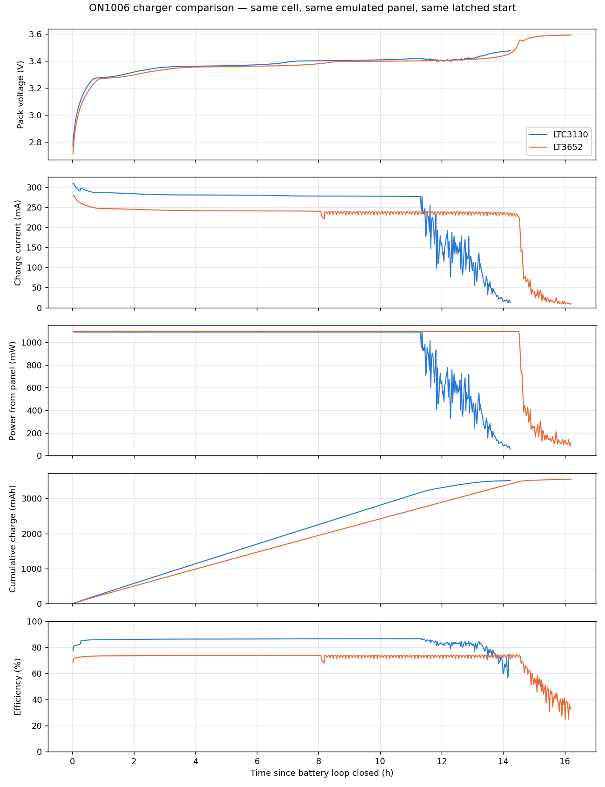

# ON1006 Charger Comparison: LTC3130 vs LT3652

Two ON1006 boards, identical fixture and cell: the LTC3130 revision and the original LT3652 revision, each charging the same protection-latched LiFePO4 pack from 0 V terminals to termination against the same measured panel curve. Both runs are single uninterrupted logs, run back to back on the same cell with the pack discharged to its protection latch before each.

## Summary

| | LTC3130 | LT3652 |
|---|---|---|
| Start → end | 2026-09-17 16:30 → 2026-09-18 06:44 | 2026-09-16 12:49 → 2026-09-17 05:01 |
| Cycle time to termination | 14 h 13 min | 16 h 12 min |
| Terminated by | taper: i_chg < 20 mA for 5 min | taper: i_chg < 20 mA for 5 min |
| Samples | 25,617 (2 s) | 29,163 (2 s) |
| Pack voltage at loop close → peak → final | 2.730 → 3.475 → 3.475 V | 2.644 → 3.592 → 3.588 V |
| Constant-current plateau | 282 mA for 12 h 37 min (89 % of cycle) | 243 mA for 14 h 37 min (90 % of cycle) |
| Input operating point (CC) | 6.09 V / 172 mA / 1050 mW | 6.13 V / 178 mA / 1093 mW |
| Harvest of panel Pmax (CC) | 95.6 % | 99.5 % |
| Charge delivered by 10 h | 2811 mAh | 2423 mAh |
| Charge delivered at termination | 3508 mAh | 3543 mAh |
| Energy into pack | 11.79 Wh | 11.90 Wh |
| Energy from panel | 13.72 Wh | 16.30 Wh |
| Efficiency, overall | 85.9 % | 73.0 % |
| Efficiency, constant-current phase | 86.1 % | 73.4 % |
| Efficiency, excl. replay-hunt rows | 86.2 % | 73.2 % |
| Replay-hunt time (flagged) | 1.2 h | 0.9 h |
| Final current at termination | 14.7 mA | 9.7 mA |

## What is the same

- Same pack (protected LiFePO4), same latched 0 V start, same emulated panel curve and fixture, same 20 mA / 5 min end-of-charge rule.
- Both chargers unlatched the pack on the first sample and drew essentially the panel's full available power throughout the constant-current phase (≈1.1 W at ≈6.1 V), so charge current was panel-limited on both boards.

## What differs

- Neither run exercises a precharge region: the LTC3130 has none, and the LT3652's 300 mA precharge current (15 % of its 2 A programmed maximum) exceeds what this panel can deliver, so its current was panel-limited from the start. Demonstrating the LT3652 precharge step needs a source able to supply more than 300 mA.
- The two boards' float voltages differ (≈3.48 V vs ≈3.59 V), so termination lands at different pack voltages.
- Efficiency: the LTC3130 (synchronous buck-boost) runs ~86 % panel-to-pack; the LT3652 (non-synchronous buck with a Schottky rectifier at a 3.3 V output) runs ~73 %.
- The emulated panel is a software compliance replay. It is faithful while a charger holds a steady operating point and hunts once the charger's draw falls in CV; hunt rows are flagged `REPLAY_HUNT` in the `_flagged.csv` files and excluded from the "excl. hunt" efficiency. The CC phase of both runs is clean.

## Per-run reports

- LTC3130: [charge_report_ltc3130_rerun.md](charge_report_ltc3130_rerun.md) · raw log [`charge_log_ltc3130_rerun.csv`](charge_log_ltc3130_rerun.csv)
- LT3652: [charge_report_lt3652_recovery.md](charge_report_lt3652_recovery.md) · raw log [`charge_log_lt3652_recovery.csv`](charge_log_lt3652_recovery.csv)

## Fixture

Keysight B2902B CH1 replays the measured panel I-V curve `panel-iv-2026-08-24_145423` (Voc 7.71 V, Isc 0.194 A, Pmax 1.10 W at 6.25 V): source level parked at Voc, current compliance re-derived from the achieved voltage on every loop, so the charger sets the operating point. B2902B CH2 is a zero-burden series ammeter in the battery+ lead (0 V source, 3 A range). A Keysight 34461A reads the pack voltage directly at its terminals. Solar on first, battery loop second. Energy integrals are trapezoidal over consecutive 2 s samples (gaps > 10 s skipped); efficiency is Wh into the pack ÷ Wh from the panel over the same intervals.
