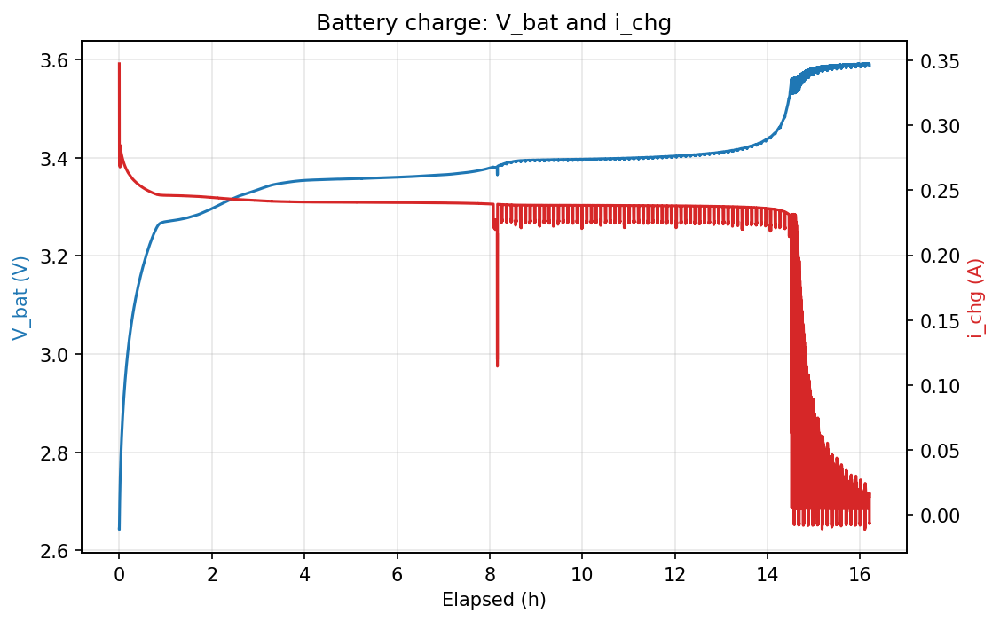
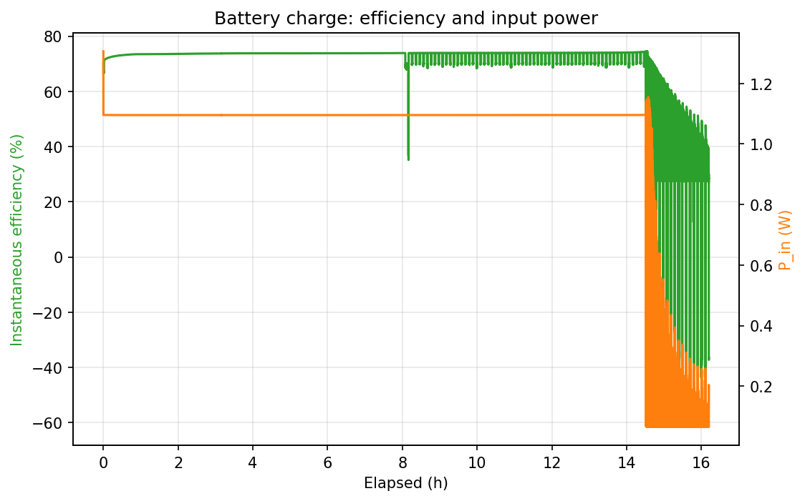

# LT3652 Recovery Charge (ON1006 original charger, 2026-09-16/17)

**Board:** ON1006 with the original LT3652 charger (schematic v1.2.0), power-floor firmware  
**Raw log:** [`charge_log_lt3652_recovery.csv`](charge_log_lt3652_recovery.csv) · hunt-flagged copy [`charge_log_lt3652_recovery_flagged.csv`](charge_log_lt3652_recovery_flagged.csv) · analysis [`charge_log_lt3652_recovery.analysis.json`](charge_log_lt3652_recovery.analysis.json)

## Summary

| | |
|---|---|
| Start → end | 2026-09-16 12:49 → 2026-09-17 05:01 |
| Cycle time to termination | 16 h 12 min |
| Terminated by | taper: i_chg < 20 mA for 5 min |
| Samples | 29,163 (2 s) |
| Pack voltage at loop close → peak → final | 2.644 → 3.592 → 3.588 V |
| Constant-current plateau | 243 mA for 14 h 37 min (90 % of cycle) |
| Input operating point (CC) | 6.13 V / 178 mA / 1093 mW |
| Harvest of panel Pmax (CC) | 99.5 % |
| Charge delivered by 10 h | 2423 mAh |
| Charge delivered at termination | 3543 mAh |
| Energy into pack | 11.90 Wh |
| Energy from panel | 16.30 Wh |
| Efficiency, overall | 73.0 % |
| Efficiency, constant-current phase | 73.4 % |
| Efficiency, excl. replay-hunt rows | 73.2 % |
| Replay-hunt time (flagged) | 0.9 h |
| Final current at termination | 9.7 mA |

## Plots

## Notes

- Board: ON1006 with the original LT3652 charger (schematic v1.2.0 Power sheet). Same fixture, same panel curve, same pack as the LTC3130 run; single uninterrupted log from a terminal-launched logger.
- Full cycle from a protection-latched 0 V pack to termination: 16.2 h (12:49 to 05:01), ending on the 20 mA / 5 min taper rule. Pack peaked at 3.592 V and finished at 3.588 V; the LT3652 float on this board is therefore about 3.59 V, not the 3.50 V design target. Resting voltage after outputs off is in the run summary below.
- No visible precharge step here either, but for a different reason than the LTC3130 board: the LT3652 precharge current is 15 % of the 2 A programmed maximum = 300 mA, above what the panel can deliver (~280 mA), so the current was panel-limited from the first sample (347 mA at 2.644 V). Demonstrating the precharge region needs a source able to supply more than 300 mA.
- Input sat at 6.13 V / 179 mA / 1.10 W for the whole CC phase — the emulated panel's current limit, not the LT3652's 4.7 V VIN_REG floor, was the binding constraint, so its input regulation never engaged. The MPPT harvest figure is therefore a property of the panel limit, not of the charger.
- Constant-current efficiency 73.4 % (charge current 238-245 mA at 3.28-3.40 V) versus 86 % on the LTC3130 board at the same power — the non-synchronous buck's Schottky rectifier loss at a 3.3 V output. Overall 73.0 %; 73.2 % excluding replay-hunt rows.
- Panel-replay artifact: from CV onset (~03:20) to the end the closed-loop replay hunted between Voc and its low clamp as the charger's draw fell; 1568 rows (0.87 h) are flagged REPLAY_HUNT and excluded from the clean efficiency. Low current with the input parked at Voc is genuine taper and is not flagged. The CC phase (12:49-03:20) is clean.
- Comparison, LTC3130 board (2026-09-15/16 run): 15.3 h, 3.26 Ah logged (+~0.13 Ah unlogged), 85.6 % overall / 86.1 % clean efficiency, peak 3.475 V, 4.1 h of replay hunting. LT3652 board (this run): 16.2 h, 3.54 Ah, 73.0 % overall, peak 3.592 V. Both recovered the latched pack on the first sample.

## Fixture

Keysight B2902B CH1 replays the measured panel I-V curve `panel-iv-2026-08-24_145423` (Voc 7.71 V, Isc 0.194 A, Pmax 1.10 W at 6.25 V): source level parked at Voc, current compliance re-derived from the achieved voltage on every loop, so the charger sets the operating point. B2902B CH2 is a zero-burden series ammeter in the battery+ lead (0 V source, 3 A range). A Keysight 34461A reads the pack voltage directly at its terminals. Solar on first, battery loop second. Energy integrals are trapezoidal over consecutive 2 s samples (gaps > 10 s skipped); efficiency is Wh into the pack ÷ Wh from the panel over the same intervals.
