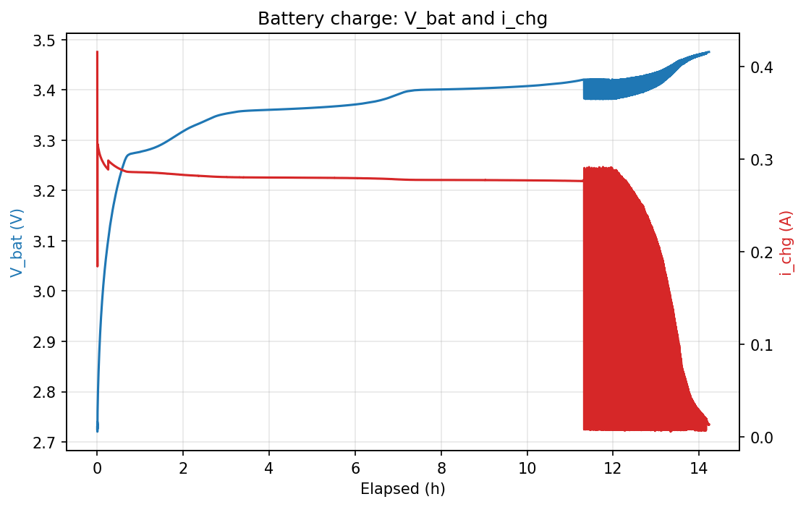
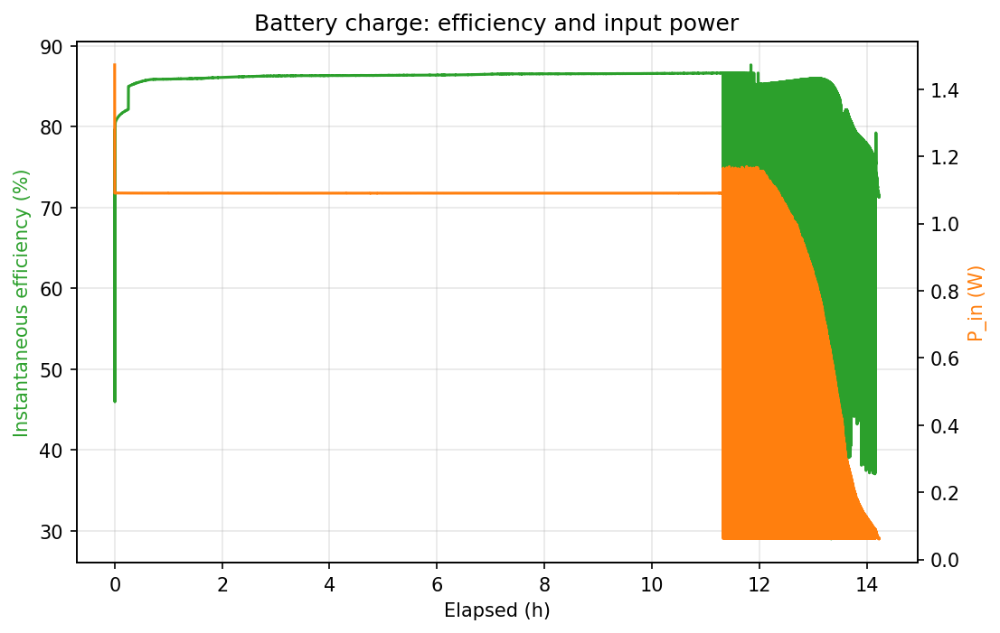

# LTC3130 Recovery Charge (ON1006 rev LTC3130, 2026-09-17/18)

**Board:** ON1006 rev LTC3130 (rev 1.2.x), power-floor firmware  
**Raw log:** [`charge_log_ltc3130_rerun.csv`](charge_log_ltc3130_rerun.csv) · hunt-flagged copy [`charge_log_ltc3130_rerun_flagged.csv`](charge_log_ltc3130_rerun_flagged.csv) · analysis [`charge_log_ltc3130_rerun.analysis.json`](charge_log_ltc3130_rerun.analysis.json)

## Summary

| | |
|---|---|
| Start → end | 2026-09-17 16:30 → 2026-09-18 06:44 |
| Cycle time to termination | 14 h 13 min |
| Terminated by | taper: i_chg < 20 mA for 5 min |
| Samples | 25,617 (2 s) |
| Pack voltage at loop close → peak → final | 2.730 → 3.475 → 3.475 V |
| Constant-current plateau | 282 mA for 12 h 37 min (89 % of cycle) |
| Input operating point (CC) | 6.09 V / 172 mA / 1050 mW |
| Harvest of panel Pmax (CC) | 95.6 % |
| Charge delivered by 10 h | 2811 mAh |
| Charge delivered at termination | 3508 mAh |
| Energy into pack | 11.79 Wh |
| Energy from panel | 13.72 Wh |
| Efficiency, overall | 85.9 % |
| Efficiency, constant-current phase | 86.1 % |
| Efficiency, excl. replay-hunt rows | 86.2 % |
| Replay-hunt time (flagged) | 1.2 h |
| Final current at termination | 14.7 mA |

## Plots

## Notes

- Board: ON1006 with the LTC3130 charger (rev 1.2.x), second full cycle. Same fixture, same panel curve, same pack as run 1 and the LT3652 run; the pack was discharged back to its protection latch after the LT3652 cycle. Single uninterrupted log from a terminal-launched logger.
- Full cycle from a protection-latched 0 V pack to termination: 14.2 h (16:30 to 06:44), ending on the 20 mA / 5 min taper rule. Pack peaked and finished at 3.475 V, the same 3.475 V as run 1, consistent with the regulator's programmed 3.485 V output less the drop across the lead and protection FET.
- No precharge / trickle region, as in run 1. On the first sample after the loop closed (t = 0.1 s, terminals at 2.730 V) the charger delivered 416 mA (run 1: 425 mA at 2.662 V), settled to ~315 mA within 30 s and then sat on the panel-limited 282 mA plateau. Current is set by the available panel power, not by the charger.
- Constant-current plateau 282 mA for 12.6 h (until 03:50) with the input held at 6.09 V / 172 mA / 1.05 W (95.6 % of the panel's Pmax). Charge delivered 3.508 Ah; 11.79 Wh into the pack from 13.72 Wh of panel energy.
- Efficiency 85.9 % overall, 86.1 % over the constant-current phase, 86.2 % excluding replay-hunt rows. Run 1 measured 85.6 % / 86.1 % / 86.1 %: the two LTC3130 cycles agree to within 0.3 points.
- Panel-replay artifact: from the first charger dropout at 03:50 (11.3 h) to termination the closed-loop replay hunted between Voc and its low clamp as the charger's draw fell; 2245 rows (1.25 h) are flagged REPLAY_HUNT and excluded from the clean efficiency. Low current with the input parked at Voc is genuine taper and is not flagged. The CC phase is clean. Run 1 had 4.1 h of hunting; the difference is where the software replay lost lock, not a charger difference.
- Comparison. LTC3130 run 1 (2026-09-15/16): 15.3 h, 3.26 Ah logged + ~0.13 Ah unlogged, 85.6 % overall / 86.1 % clean, peak 3.475 V. LT3652 (2026-09-16/17): 16.2 h, 3.54 Ah, 73.0 % overall, peak 3.592 V. This run: 14.2 h, 3.51 Ah, 85.9 % / 86.2 %, peak 3.475 V. All three recovered the latched pack on the first sample.
- Energy integrals are trapezoidal over consecutive samples (2 s spacing, gaps > 10 s skipped); efficiency = Wh into the pack / Wh from the panel over the same intervals.

## Fixture

Keysight B2902B CH1 replays the measured panel I-V curve `panel-iv-2026-08-24_145423` (Voc 7.71 V, Isc 0.194 A, Pmax 1.10 W at 6.25 V): source level parked at Voc, current compliance re-derived from the achieved voltage on every loop, so the charger sets the operating point. B2902B CH2 is a zero-burden series ammeter in the battery+ lead (0 V source, 3 A range). A Keysight 34461A reads the pack voltage directly at its terminals. Solar on first, battery loop second. Energy integrals are trapezoidal over consecutive 2 s samples (gaps > 10 s skipped); efficiency is Wh into the pack ÷ Wh from the panel over the same intervals.
